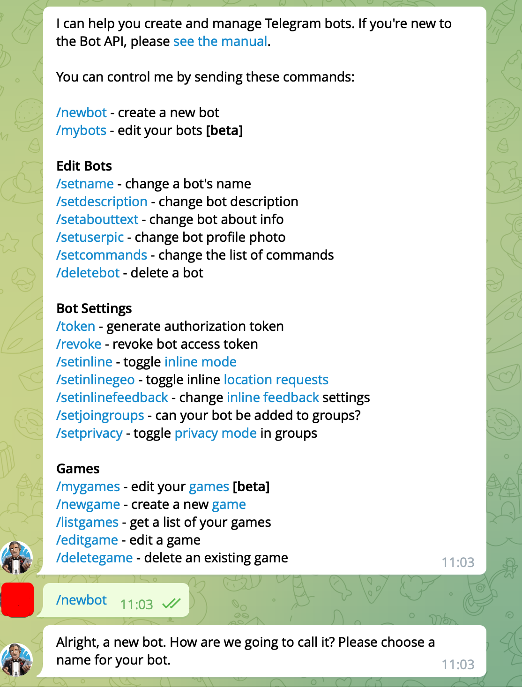
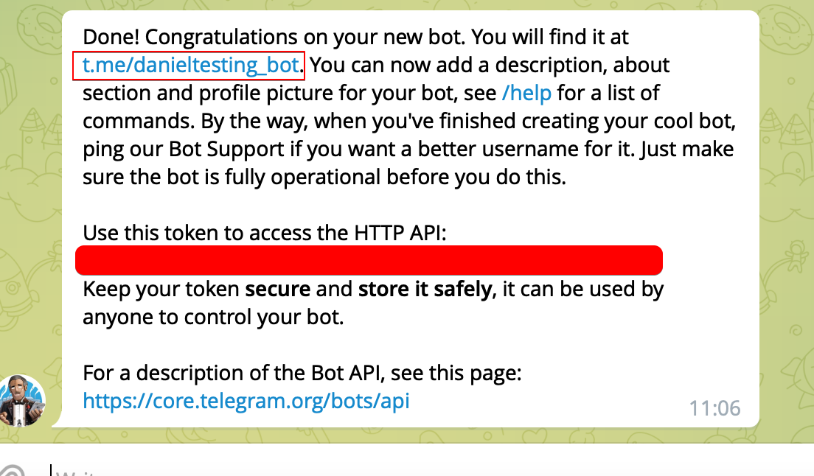
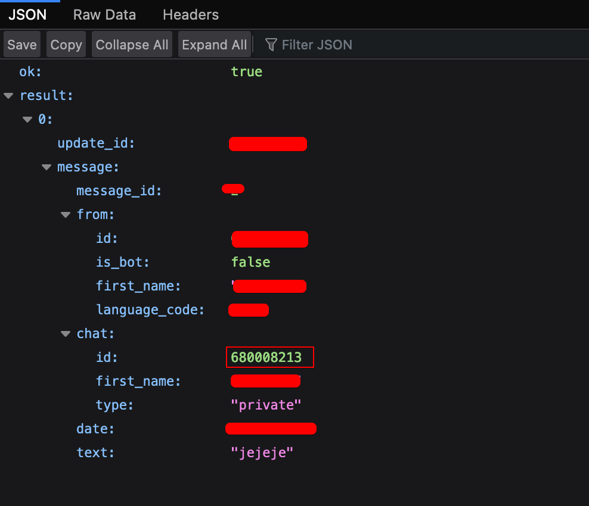

# (BETA) python-telegram-bot
Alerts to telegram group (with a bot), when someone logs in to a server via ssh

# Installation

### Requirements

* python3-pip

```sh
$ pip3 install sshd-telegram-alert
```

### Start using the script

```sh
$ sshd-telegram-alert --help
```
### Modes

By the moment the are 2 different modes to send a message to your bot chat:

1. Normal usage sending a message

```sh
sshd-telegram-alert -m "This is an example message" # first you will need execute -c flag to store credentials (chat_id and telegram_token API)
```

2. Loading variables of the PAM module with sshd

```sh
sshd-telegram-alert -m "Alert!!!" -sp # -sp will add variables in the message like PAM_RHOST... Also you will need to create the credentials file with -c flag
```

### Adding the script inside **/etc/pam.d/sshd**

```
$ nvim /etc/pam.d/sshd
```

Add this lines:

```sh
# Login Telegram Notification
session optional pam_exec.so /etc/ssh/login_notification.sh
```

Create the script:

```
$ nvim /etc/ssh/login_notification.sh
#!/usr/bin/env bash
sshd-telegram-alert -sp -m "Alert!" >> /var/log/telegram-sshd-alerting.log
```


## How to get your telegram_token and CHAT_ID

1. Open your telegram app and go to **bot father**:

Type /help to get the list of all the allowed commands, then type /newbot:



Telegram will ask about the name, username...etc Complete with your parameters.

Example:

> My bot is danieltesting and the username is danieltesting_bot.

Then you will see something like this:



> **IMPORTANT**: copy the token to allow http request to the API

Click on **t.me/danieltesting_bot** and start the bot.


2. Get the chat_id

Type some message inside the new chat created with the bot:


Then, we can see the latest updates with this bot in telegram API:

curl https://api.telegram.org/botYOURHTTP_TOKEN/getUpdates | jq

Or put the URL in the browser, and get the chat_id:



**CONGRATULATIONS** you have all the necessary credentials to start using this program. To store that credentials you will need to use:

```sh
sshd-telegram-alert -c
```

# Create executable

/etc/ssh/login_notification.sh
```
#!/usr/bin/env bash

sshd-telegram-alert > /tmp/sshd.log
```


```
$ chown root:root /etc/ssh/login_notification.sh 
$ chmod 700 /etc/ssh/login_notification.sh
```

vim /etc/pam.d/sshd

# Login Telegram Notification
session optional pam_exec.so /etc/ssh/login_notify.sh


requirements:

```
python3-pip
```